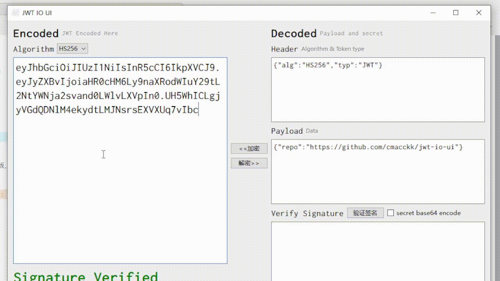

# JWT-IO-UI

JWT-IO-UI 是因为线下无法使用`jwt`编写的一款工具，后续打算加入`secret`破解功能

## 安装

`python>=3.6`

```bash
python -m pip install -r requirments.txt
```

或者直接在`Release`找到`.zip`文件，解压后即可正常使用，目前只打包了`windows`版，需要其他平台版本可自己打包

## 使用



## 我的打包命令

```bash
pyinstaller -i .\icon\jwt.ico -w -F .\main.py .\main.spec
```